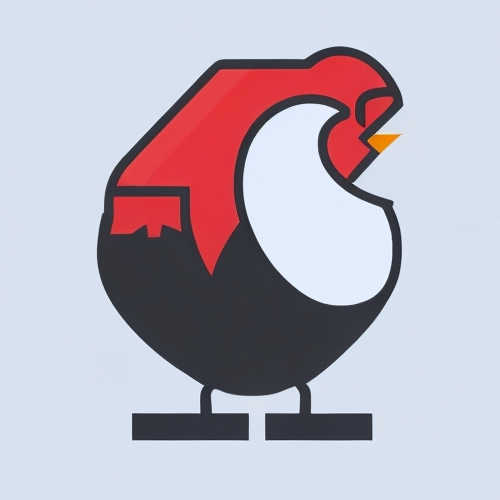

# Chickenfoot



🐔 Chickenfoot is a two-dimensional programming language for chickens.

Inspired by a chicken tap dance with dominos:


```chickenfoot
          ⠮       ⠮
         ⠮ ⠫     ⠮ ⠫
        ⠷⠈⠧⠩    ⠷⠌⠧⠩
       ⠹ ⠼     ⠹
      ⠹   ⠼   ⠹
     ⠹     ⠼ ⠹
⠿⠽⠽⠽⠘⠋⠏⠠⠬   ⠚⠋⠏⠢⠬
     ⠫  ⠮    ⠫  ⠮
      ⠫⠯      ⠫⠯
```

## How it works

The program is equipped with **four registers** further referenced as
 *r0*, *r1*, *r2*, and *r3*. Each register holds an unbounded integer
 value.

The execution starts at the begin command and continues left-to-right
 as the default. The flow can be altered by the 
 *conditional branching command* or by a handful of *flow commands*. 
 In this way, loops can be created.

The program halts when a whitespace is read.

## Commands

Each command consists of a single symbol of the Braille 6-dot patterns:

```
  1 2
A o o
B o o
C o o
```

Braille symbols that do not fit any command definition and all other
 symbols are interpreted as whitespaces.

The **begin** command `⠿` indicates the beginning of the program. 
 Each program must include exactly one begin command:

```chickenfoot
⠿
```

Except for the begin command, dots in the second column indicate the
 operation:

| Col | Rows | Operation             | Precedence | Examples |
|:---:|:----:| --------------------- |:----------:|:--------:|
| 2   | A    | Increment             | 1          | `⠏`, `⠋` |
| 2   | C    | Decrement             | 1          | `⠧`, `⠦` |
| 2   | B    | Conditional branching | 2          | `⠟`, `⠷` |
| 2   | A+C  | Flow                  | 3          | `⠽`, `⠫` |

Operations *conditional branching* and *flow* combine other dots as
 additional parameters.

For **arithmetic commands** increment, decrement, and the 
 **control flow** command conditional branching, the number of dots in
 the first column indicates the index of a register to work with:

| Col | Number of dots | Register | Examples |
|:---:|:--------------:|:--------:|:--------:|
| 1   | 0              | r0       | `⠈`, `⠘` |
| 1   | 1              | r1       | `⠉`, `⠜` |
| 1   | 2              | r2       | `⠋`, `⠝` |
| 1   | 3              | r3       | `⠏`, `⠟` |

The vertical position of dots in the column is irrelevant and fully
 aesthetics-driven. The following commands are equivalent:
 `⠋`, `⠍`, `⠎`.

### Increment

The increment command increases the value of the selected register.

An example of incrementing *r2* two times:

```chickenfoot
⠿⠍⠋
```

### Decrement 

The decrement command decreases the value of the selected register if 
 its current value is greater than zero.

An example of decrementing *r1* two times after 
 incrementing it three times:

```chickenfoot
⠿⠉⠉⠉⠡⠢
```

### Conditional branching

Conditional branching changes the control flow based on the current 
 value of the selected register. If the value equals zero, the flow 
 branches; otherwise, it continues left-to-right.

The command always comes with another dot in the second row, which 
 indicates the direction of the control flow in the case when the value
 of the selected register is **equal to zero**:

| Rows | Zero flow direction  | Examples |
|:----:| -------------------- |:--------:|
| B+A  | Northeast (↗)        | `⠟`, `⠙` |
| B+C  | Southeast (↘)        | `⠷`, `⠱` |

An example of setting *r3* to one if *r2* is greater than three:

```chickenfoot
⠿⠣⠣⠣⠳⠏
```

### Flow

The flow operation changes the control flow of the program.

The number of dots in the first column indicates the direction:

| Command | Flow direction  |
|:-------:| --------------- |
| `⠩`     | North (↑)       |
| `⠹`     | Northeast (↗)   |
| `⠽`     | East (→)        |
| `⠼`     | Southeast (↘)   |
| `⠬`     | South (↓)       |
| `⠮`     | Southwest (↙)   |
| `⠯`     | West (←)        |
| `⠫`     | Northwest (↖)   |

A flow into the chicken hole:

```chickenfoot
⠿⠽⠽⠽⠽⠼
 ⠫     ⠬
 ⠩     ⠮
  ⠫⠯⠯⠯
```

## Examples

### No-op program

The simplest valid program:

```chickenfoot
⠿
```

### Infinite loop

Don't try this at home!

```chickenfoot
⠿⠯
```

### Truth-machine

If *r0* contains 1, the program sets *r1* to 1:

```chickenfoot
⠿⠰⠊
```

### Copier

The program copies content of *r0* to *r1*:

```chickenfoot
  ⠮⠯⠯⠯
⠿⠰⠊⠍⠠⠩
  ⠼ ⠮⠯⠯
   ⠵⠈⠣⠩
```

### Fibonacci sequence

The program takes an index in *r0* and computes the corresponding 
 Fibonacci number in *r2*:

```chickenfoot
        ⠮
       ⠮ ⠫
⠿⠰⠋⠠⠘⠠⠳⠣⠌⠏⠫
     ⠫ ⠼
      ⠫ ⠼ ⠮⠯
       ⠫ ⠲⠢⠎⠫
        ⠫ ⠼
         ⠫ ⠼ ⠮⠯
          ⠫ ⠷⠧⠌⠫
           ⠫⠯⠯
```

### Addition of two numbers

An alternative version of a program which adds values in *r0* and *r1*
 to *r2*:

```chickenfoot
             ⠟⠉⠧⠬
            ⠹   ⠮
           ⠹ ⠫⠯⠯
          ⠹
         ⠚⠋⠏⠢⠬
        ⠹    ⠮
       ⠹ ⠫⠯⠯⠯
      ⠹
     ⠟⠈⠧⠬
    ⠹   ⠮
   ⠹ ⠫⠯⠯
  ⠹
⠿⠘⠎⠏⠠⠬
  ⠫  ⠮
   ⠫⠯
```

## Try it

This repository contains a JavaScript interpreter for Chickenfoot.

```sh
npm i chickenfoot
```

It takes source code as the first argument and optionally initial
 register values:

```js
const chickenfoot = require('chickenfoot')

// addition of two numbers
const output = chickenfoot(`
         ⠮       ⠮
        ⠮ ⠫     ⠮ ⠫
       ⠷⠈⠧⠩    ⠷⠌⠧⠩
      ⠹ ⠼     ⠹
     ⠹   ⠼   ⠹
    ⠹     ⠼ ⠹
  ⠿⠘⠋⠏⠠⠬   ⠚⠋⠏⠢⠬
    ⠫  ⠮    ⠫  ⠮
     ⠫⠯      ⠫⠯
  `,
  2, 3)  // x=2, y=3

output[0] // 2 (x)
output[1] // 3 (y)
output[2] // 5 (x+y)
output[3] // 0
```

## Development

**Cascadia Code** is the recommended code editor font for Chickenfoot.

### Testing

```sh
npm test
```

## License

[MIT](LICENSE)
